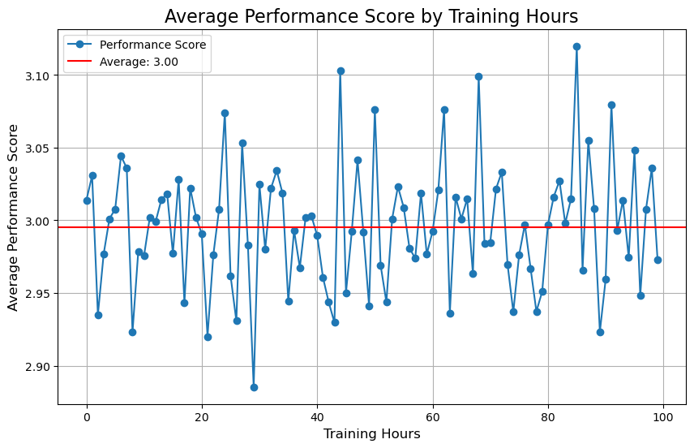

# Overview

Welcome to my analysis of the Employee Performance, in this project data comes from Kaggle. https://www.kaggle.com/datasets/mexwell/employee-performance-and-productivity-data

# The Questions

1. What is the distribution of gender among employees?

2. What are the mean values for age, tenure at the company, performance score, salary, weekly work hours, number of projects handled, and team size?
3. How many employees are categorized by job title and department?
4. What are the overall hiring trends over the years?
5. What is the distribution of education levels among employees?
6. How do education levels differ across departments?
7. Is there a relation between education level and salary?
8. Which department has the highest average work hours and number of projects handled? Is there a correlation between work hours, number of projects handled?
9. Is there a relation between remote work and the number of projects handled?
10. Is there a relation between the number of projects handled and promotions received?
11. How does employee satisfaction vary across gender and departments?
12. Is there a relation between training hours, performance scores?
13. Is there a lower satisfaction score among employees who work more overtime?
14. Is there a lower satisfaction score among monthly salary?

# Tools I Used

For my deep dive into the data analyst job market, I harnessed the power of several key tools:

- Python: The backbone of my analysis, allowing me to analyze the data and find critical insights.I also used the following Python libraries:
  - Pandas Library: This was used to analyze the data.
  - Matplotlib Library: I visualized the data.
  - Seaborn Library: Helped me create more advanced visuals.
- Jupyter Notebooks: The tool I used to run my Python scripts which let me easily include my notes and analysis.
- Visual Studio Code: My go-to for executing my Python scripts.
- Git & GitHub: Essential for version control and sharing my Python code and analysis, ensuring collaboration and project tracking.

# Data Preparation and Cleanup

This section outlines the steps taken to prepare the data for analysis, ensuring accuracy and usability.

### Import & Clean Up Data

```python
# We have 100.000 rows and 20 columns.
df.shape

# There are no null values.
df.isnull().sum()

# There are no duplicate values
df.drop_duplicates()

# Date should be date type not object.
df.dtypes

df['Department'].unique() # There are no inconsistencies like HR -hr
df['Gender'].unique() # no problem
df['Job_Title'].unique() # no problem

df.describe()# There are no unrealistic values
```

# Analysis
### 1. What is the distribution of gender among employees?

```python
# 1 - What is the distribution of gender among employees?
df_gender = df['Gender'].value_counts().to_frame()

plt.pie(df_gender['count'], labels=df_gender.index, autopct='%1.1f%%')

plt.title('Gender Distribution')
plt.xlabel('')
plt.ylabel('')
```


#### Insights
- Gender distribution is equal for male and female.

### 2. What are the mean values for age, years at the company, performance score, salary, weekly work hours, number of projects handled, and team size?

| Feature                      | Value  |
|------------------------------|--------|
| Age                          | 41.0   |
| Years_At_Company             | 4.0    |
| Performance_Score            | 3.0    |
| Monthly_Salary               | 6500 |
| Work_Hours_Per_Week          | 45.0   |
| Projects_Handled             | 24.0   |
| Overtime_Hours               | 15.0   |
| Sick_Days                    | 7.0    |
| Remote_Work_Frequency        | 50.0   |
| Team_Size                    | 10.0   |
| Training_Hours               | 49.0   |
| Promotions                   | 1.0    |
| Employee_Satisfaction_Score  | 3.0    |
| Resigned                     | 0.0    |

### 3. How many employees are categorized by job title and department?

```python
df_dep = df['Department'].value_counts().reset_index()
df_tit = df['Job_Title'].value_counts().reset_index()

plt.figure(figsize=(12,8))
plt.subplot(2,2,1)
plt.barh(df_dep['Department'], df_dep['count'])
plt.title('Number of Employee')

plt.subplot(2,2,2)
plt.barh(df_tit['Job_Title'], df_tit['count'])
plt.title('Number of Employee')

plt.tight_layout()
```


#### Insights
- Number of employee by job title and department is strongly correlated.

### 4. What are the overall hiring trends over the years?

```python
df_hire_date = df.groupby(['Hire_Year', 'Hire_Month'])['Job_Title'].value_counts().reset_index()
df_hire_year_sum = df_hire_date.groupby(['Hire_Year'])['count'].sum().reset_index()

plt.plot(df_hire_year_sum['Hire_Year'], df_hire_year_sum['count'])
plt.ylabel('Number of Hire')
plt.title('Overall hiring trends over the years')
plt.ylabel('Number of Hire')
plt.xlabel('year')
```


*Starts with 09.2014 and end with 09.2024.*


#### Insights
- Hiring are similar by years.
- Highest hire number is on October.

### 5. What is the distribution of education levels among employees?

```python
df_edu = df['Education_Level'].value_counts().to_frame()

plt.pie(df_edu['count'], labels=df_edu.index, autopct='%1.1f%%')

plt.title('Distribution of education levels among employees')
plt.xlabel('')
plt.ylabel('')
```


#### Insights
- Majority of the employee have bachelor degree.

### 6. How do education levels differ across departments?

```python
df_edu_dep = df.groupby('Department')['Education_Level'].value_counts().reset_index()
df_edu_dep_pivot = df_edu_dep.pivot_table(index='Department', columns='Education_Level', values='count')
                                          
line_plot = df_edu_dep_pivot.iloc[:, :4].plot(kind='line')  # Adding markers for better visibility

plt.title('Education levels differ across departments')
plt.ylabel('Number of Degree')
plt.xlabel('')
plt.xticks(rotation=45, ha='right')
plt.grid()
plt.legend(title='Department', bbox_to_anchor=(1.05, 1), loc='upper left', borderaxespad=0.)

plt.tight_layout()
plt.show()
```


#### Insights
- Number of degree between department is strongly similar.

### 7. Is there a relation between education level and salary?

```python
df_edu_sal = df.groupby('Education_Level')['Monthly_Salary'].mean().reset_index(name='mean_salary')

plt.barh(df_edu_sal['Education_Level'], df_edu_sal['mean_salary'])

plt.title('Average Monthly Salary by Education Level')
plt.xlabel('Education Level')
plt.ylabel('Average Monthly Salary')

plt.tight_layout()  
plt.show()
```


#### Insights
- Monthly salary by education level is strongly similar.

### 8. Which department has the highest average work hours and number of projects handled? Is there a relation between work hours, number of projects handled?

```python
df.groupby('Department')[['Work_Hours_Per_Week','Projects_Handled']].mean().sort_values(by='Projects_Handled')
```

| Department        | Work_Hours_Per_Week | Projects_Handled |
|-------------------|---------------------|------------------|
| HR                | 44.929106           | 24.200912        |
| Legal             | 45.012772           | 24.212808        |
| Operations        | 44.968339           | 24.295144        |
| Finance           | 44.893661           | 24.409375        |
| Engineering       | 45.074297           | 24.421504        |
| Customer Support  | 44.906621           | 24.428661        |
| IT                | 44.929476           | 24.538945        |
| Marketing         | 44.887571           | 24.661020        |
| Sales             | 45.013037           | 24.707427        |

#### Insights
- Work hours and project handled number are strongly similar by departments. 
- There are no relation between work hours, number of projects handled.

### 9. Is there a relation between remote work and the number of projects handled?

```python
df.groupby('Remote_Work_Frequency')['Projects_Handled'].mean().to_frame()
```

| Remote_Work_Frequency | Projects_Handled |
|-----------------------|------------------|
| 0                     | 24.494732        |
| 25                    | 24.412800        |
| 50                    | 24.248655        |
| 75                    | 24.543895        |
| 100                   | 24.452791        |

#### Insights
- There is no relation between remote work and the number of projects handled

### 10. Is there a relation between the number of projects handled and promotions received?

```python
df.groupby('Promotions')['Projects_Handled'].sum().to_frame()
```

| Promotions | Projects_Handled |
|------------|------------------|
| 0          | 812787           |
| 1          | 820994           |
| 2          | 809336           |

#### Insights
- There is no relation between the number of projects handled and promotions received.

### 11. How does employee satisfaction vary across gender and departments?

```python
df.groupby('Gender')['Employee_Satisfaction_Score'].mean().to_frame()
```

| Gender | Employee_Satisfaction_Score |
|--------|------------------------------|
| Female | 3.004598                     |
| Male   | 2.994508                     |
| Other  | 2.987893                     |

#### Insights
- It is strongly similar.

### 12. Is there a relation between training hours, performance scores?

```python
df_tra_per = df.groupby('Training_Hours')['Performance_Score'].mean().reset_index()

avg_perf_score = df['Performance_Score'].mean() 

plt.figure(figsize=(10, 6))
plt.plot(df_tra_per['Training_Hours'], df_tra_per['Performance_Score'], marker='o', label='Performance Score')

plt.axhline(y=avg_perf_score, color='r', label=f'Average: {avg_perf_score:.2f}')

plt.title('Average Performance Score by Training Hours', fontsize=16)
plt.xlabel('Training Hours', fontsize=12)
plt.ylabel('Average Performance Score', fontsize=12)
plt.legend()
plt.grid(True)

plt.show()
```



#### Insights
- There is no relation between training hours, performance scores.

### 13. Is there a lower satisfaction score among employees who work more overtime?


```python
df_sat_overt = df.groupby('Overtime_Hours')['Employee_Satisfaction_Score'].mean().reset_index()

plt.figure(figsize=(10, 6))
plt.plot(df_sat_overt['Overtime_Hours'], df_sat_overt['Employee_Satisfaction_Score'], marker='o', label='Satisfaction Score')

plt.title('Relation Between Satisfaction Score and Work Overtime', fontsize=16)
plt.xlabel('Overtime Hours', fontsize=12)
plt.ylabel('Satisfaction Score', fontsize=12)
plt.legend()
plt.grid(True)

plt.show()
```


#### Insights
- There is no lower satisfaction score among employees who work more overtime.

### 14. Is there a lower satisfaction score among monthly salary?

```python
df_sat_overt = df.groupby('Monthly_Salary')['Employee_Satisfaction_Score'].mean().reset_index()

plt.figure(figsize=(10, 6))
plt.plot(df_sat_overt['Monthly_Salary'], df_sat_overt['Employee_Satisfaction_Score'], marker='o', label='Satisfaction Score')


avg_salary = df['Monthly_Salary'].mean() 
plt.axvline(x=avg_salary, color='r', label=f'Average Salary: {avg_salary:.2f}')


avg_sat_sco = df['Employee_Satisfaction_Score'].mean() 
plt.axhline(y=avg_sat_sco, color='r', label=f'Average Satisfaction: {avg_sat_sco:.2f}')


plt.title('Relation Between Monty Salary and Satisfaction Score', fontsize=16)
plt.xlabel('Overtime Hours', fontsize=12)
plt.ylabel('Satisfaction Score', fontsize=12)
plt.legend()
plt.grid(True)

plt.show()
```


#### Insights
- There is no lower satisfaction score among monthly salary.

# Conclusion
We answered some questions to learn more about employees.